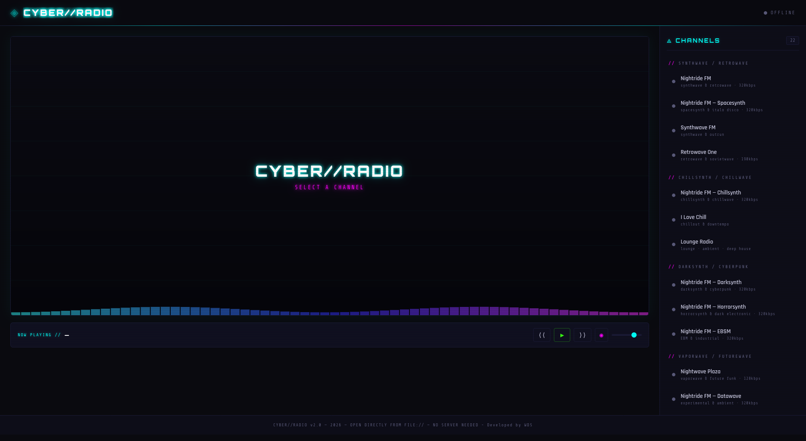
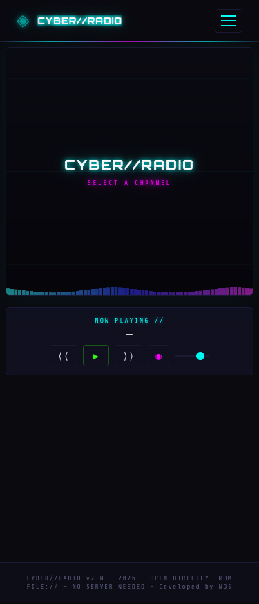

# ◈ CYBER//RADIO

# ITS A VIBE CODING PROJECT

**A cyberpunk-themed internet radio portal for live audio streams. No servers, no accounts, no ads. Just open and listen.**


CYBER//RADIO is a self-contained web application that streams live internet radio stations across genres like synthwave, retrowave, darksynth, vaporwave, lofi, deep house, and more. It runs entirely in the browser — just open `index.html` and start listening.

**Check it on https://cyberradio.wd5.io/**

---

## Screenshots

| Desktop | Mobile |
|---------|--------|
|  |  |

---

## Features

- **22 curated stations** across 7 genre categories, all free public streams (Icecast / Shoutcast)
- **Cyberpunk UI** — CRT scanlines, glitch text animation, neon glow effects, animated canvas visualizer
- **Fully responsive** — works on desktop, tablet, and mobile with collapsible sidebar
- **Wake Lock API** — prevents screen from sleeping while audio is playing (⏾ indicator in header)
- **Media Session API** — lock screen controls with station name, play/pause, and skip (like YouTube or Spotify)
- **No server required** — open `index.html` directly from the filesystem (`file://`), no Python, no Node, nothing
- **No ads** — all streams are ad-free public radio stations
- **Keyboard shortcuts** — `←` `→` navigate channels, `Space` play/pause, `M` mute
- **Volume control** — slider + mute toggle
- **Easy to extend** — add stations by editing a single array in `functions.js`

---

## Stations

| Category | Stations | Highlights |
|----------|----------|------------|
| Synthwave / Retrowave | 4 | Nightride FM, Spacesynth, Synthwave FM, Retrowave One |
| Chillsynth / Chillwave | 3 | Nightride Chillsynth, I Love Chill, Lounge Radio |
| Darksynth / Cyberpunk | 3 | Nightride Darksynth, Horrorsynth, EBSM |
| Vaporwave / Futurewave | 2 | Nightwave Plaza, Nightride Datawave |
| Lofi / Chillhop | 3 | Lofi Radio, Planet LoFi, Radio Paradise Mellow |
| House / Deep House | 4 | Deep House Sounds, I Love Dance, HouseTime FM |
| Electronic / Bass | 3 | Nightride Rekt, Dancewave Retro, Gora Electro |

Most streams are **320kbps MP3** from verified Icecast/Shoutcast servers.

---

## Quick Start

1. **Clone the repo:**

```bash
git clone https://github.com/danyelous/cyberradio.git
```

2. **Open `index.html`** in your browser — that's it. No build step, no dependencies, no server.

```bash
cd cyberradio
open index.html        # macOS
xdg-open index.html    # Linux
start index.html       # Windows
```

3. **Pick a channel** from the sidebar and enjoy.

---

## Adding Stations

Edit `functions.js` and find the `STATION_GROUPS` array. Add a new station to an existing group:

```javascript
{
    url: 'https://stream.example.com/radio.mp3',
    name: 'My Station',
    tag: 'genre · bitrate',
},
```

Or create an entirely new group:

```javascript
{
    label: 'MY GENRE',
    stations: [
        {
            url: 'https://stream.example.com/radio.mp3',
            name: 'My Station',
            tag: 'genre description',
        },
    ],
},
```

You can find stream URLs at:
- [Icecast Directory (dir.xiph.org)](http://dir.xiph.org/)
- [RCAST.NET](https://www.rcast.net/)
- [Internet-Radio.com](https://www.internet-radio.com/)
- [Radio Browser (community database)](https://www.radio-browser.info/)

---

## Project Structure

```
cyberradio/
├── index.html       # Main page — entry point
├── styles.css       # Cyberpunk theme, responsive layout
├── functions.js     # Stations config, player logic, Wake Lock, Media Session
├── iniciar.bat      # Optional: Windows local server launcher
├── iniciar.sh       # Optional: Linux/macOS local server launcher
└── README.md
```

Three files. No frameworks, no bundlers, no dependencies.

---

## Mobile Behavior

| Feature | Chrome Android | Samsung Internet | Safari iOS | Firefox |
|---------|---------------|-----------------|------------|---------|
| Audio playback | ✅ | ✅ | ✅ | ✅ |
| Lock screen controls | ✅ | ✅ | ✅ | ✅ |
| Background audio | ✅ | ✅ | ✅ | ✅ |
| Wake Lock (screen stays on) | ✅ | ✅ | ❌ | ❌ |

> **Wake Lock** keeps the screen on while audio is playing. When you pause, the screen returns to normal sleep behavior. The ⏾ icon in the header indicates when Wake Lock is active.
>
> **Media Session** provides playback controls on the lock screen and notification area — station name, play/pause, previous/next — just like YouTube or Spotify.

---

## Tech Stack

| What | How |
|------|-----|
| Layout | Vanilla HTML5 + CSS3 Flexbox |
| Styling | CSS custom properties, keyframe animations, `backdrop-filter` |
| Fonts | [Orbitron](https://fonts.google.com/specimen/Orbitron), [Share Tech Mono](https://fonts.google.com/specimen/Share+Tech+Mono), [Rajdhani](https://fonts.google.com/specimen/Rajdhani) |
| Audio | HTML5 `<audio>` element with Icecast/Shoutcast MP3 streams |
| Visualizer | Canvas 2D — animated frequency bars (no AudioContext required) |
| Screen lock | [Wake Lock API](https://developer.mozilla.org/en-US/docs/Web/API/Wake_Lock_API) |
| Lock screen controls | [Media Session API](https://developer.mozilla.org/en-US/docs/Web/API/Media_Session_API) |

---

## License

MIT — do whatever you want with it.

---

## Acknowledgments

Stations are publicly available internet radio streams operated by independent broadcasters. CYBER//RADIO does not host, redistribute, or modify any audio content. Notable stream providers include:

- [Nightride FM](https://nightride.fm/) — Synthwave, darksynth, chillsynth, and more
- [Nightwave Plaza](https://plaza.one/) — 24/7 vaporwave radio
- [Radio Paradise](https://radioparadise.com/) — Eclectic listener-supported radio
- [laut.fm](https://laut.fm/) — User-generated internet radio platform

---

<p align="center">
  <code>◈ CYBER//RADIO — tune in, zone out</code>
</p>
